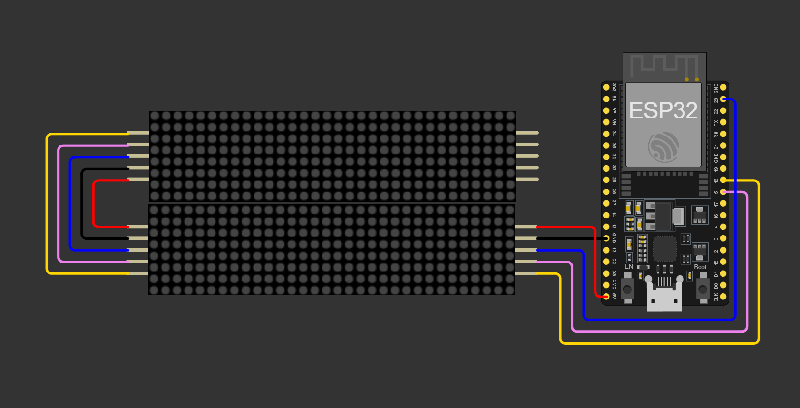

# ESP32-WeatherStationRTC

This project is an ESP32-based weather station coded with the arduino framework that displays time, temperature, humidity, pressure, and date on a matrix display. It utilizes a MAX7219 LED matrix for display, a DS3231 Real-Time Clock (RTC) for timekeeping, a BME280 sensor for measuring temperature, humidity, and pressure, and a BH1750 sensor for ambient light measurement to adjust the display brightness automatically.

## Features

- **Time and Date Display:** Utilizes the DS3231 RTC module for accurate timekeeping and displays the current time and date.
- **Temperature, Humidity, and Pressure Measurement:** Uses the BME280 sensor to measure and display the current temperature, humidity, and pressure.
- **Automatic Brightness Adjustment:** Adjusts the LED matrix display brightness based on the ambient light level detected by the BH1750 sensor.
- **WiFi Time Sync:** In case the RTC loses power, the device attempts to sync the time via an NTP server over WiFi (needs an open AP).
- **Button Control:** A button allows cycling through the display modes (time & temperature, date, humidity & pressure) and turning the display on/off with a long press.

## Hardware Requirements

- **ESP32** (other arduino compatible boards are okay, just change the pins)
- **MAX7219** LED matrix module (8 devices needed)
- **DS3231** Real-Time Clock module
- **BME280** sensor module (temperature, humidity, pressure)
- **BH1750** light sensor module
- **Push button** (the default button is the BOOT button in the ESP32-DevKitC V4 devboard)

## Software Requirements

- **PlatformIO**
- Libraries:
  - MD_Parola for controlling the MAX7219 matrix
  - RTClib for interfacing with the RTC module
  - Adafruit_BME280
  - BH1750 for the light sensor
  - Bounce2
  - NTPClient
  - Timezone

## Setup

**Hardware Setup:**
   - My board is an ESP32-DevKitC V4

| PushButton | ESP32-DevKitC V4 |
| ----------- | ----------- |
|  + | 0 |
|  - | GND |

| I2C DEVICES| ESP32-DevKitC V4 |
| ----------- | ----------- |
| VCC | 3V3 |
| GND | GND |
| SCL | 22 |
| SDA | 21 |

| MAX7219 (SPI Interface) | ESP32-DevKitC V4 |
| ----------- | ----------- |
| VCC | 3V3 |
| GND | GND |
| CLK | 18 |
| DIN | 23 |
| CS | 5 |

**N.B.** The two 4 devices displays needs to be connected like this:

**Software Setup:**
   - Install the PlatformIO IDE (or the VSCode extension).
   - Connect your board to your computer.
   - Update the pin definitions and the NTP servers if needed.
   - Change the I2C addresses if needed.
   - Change the timezone if needed.
   - Compile and upload the code to your ESP32 board.

## First boot
At the first boot the device shows "POWER LOST" and if you push the button it tries to connect to the first open AP it finds to sync the RTC with an NTP server.
### So:
- Set up an open AP (mobile hotspot is ok)
- Press the button on the clock
- Wait for it to connect to the server

**IMPORTANT**: this procedure is necessary whenever the DS3231 loses power (i.e. when the battery runs out or one is not inserted and the ESP32 loses power)

## Usage

- The device will automatically display the time and temperature upon startup.
- Press the button to cycle through the different display modes:
    - time & temperature (in Celsius)
    - date (DDD DD MMM YYYY)
    - humidity & pressure (in hPa)
- Hold the button for more than 500ms to turn off the display. Press again to turn it back on.

## License

This project is licensed under the GNU GENERAL PUBLIC LICENSE - see the LICENSE file for details.

## Credits
[Leonardo Mirabella](https://github.com/infra-blue)