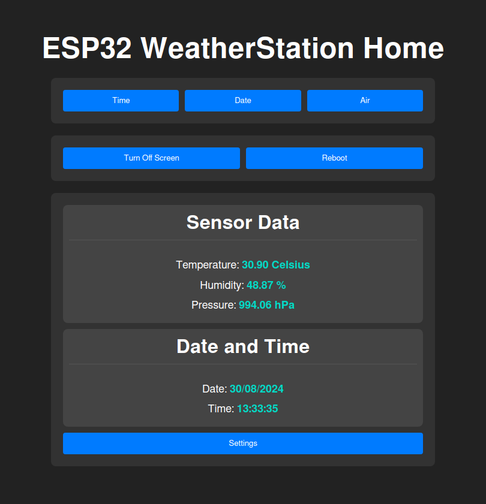

<div align = center>

# ESP32-WeatherStationRTC

</div>

<p align="center">
  <a href="https://www.codefactor.io/repository/github/infra-blue/esp32-weatherstationrtc/overview/main"></a>
  <a href=https://github.com/infra-blue/ESP32-WeatherStationRTC/commits></a>
  <a href=https://github.com/infra-blue/ESP32-WeatherStationRTC/stargazers></a>
  <a href=https://github.com/infra-blue/ESP32-WeatherStationRTC/watchers></a>
  <a href=https://github.com/infra-blue/ESP32-WeatherStationRTC/actions/workflows/dependabot.yml></a>
  <a href=https://github.com/infra-blue/ESP32-WeatherStationRTC/actions/workflows/platformio-build&release.yml></a>
  <a href=https://github.com/infra-blue/ESP32-WeatherStationRTC/releases/latest></a>
  <a href=https://github.com/infra-blue/ESP32-WeatherStationRTC/releases/latest></a>
  <a href=https://github.com/infra-blue/ESP32-WeatherStationRTC/blob/main/LICENSE></a>
</p>

<div align="center">

  

  

</div>

This project is an ESP32-based desk clock with functionality of monitoring the temperature, atmospheric pressure and humidity in the air. The display is auto dimmed. It is coded using the arduino framework.

## Features

- **Time and date:** Utilizes the DS3231 RTC module for accurate timekeeping and displays the current time and date.
- **Temperature, Humidity, and Pressure Measurement:** Uses the BME280 sensor to measure and display the current temperature, humidity, and pressure.
- **Beep Sound**: Every hour the buzzer beeps.
- **Automatic Brightness Adjustment:** Adjusts the LED matrix display brightness based on the ambient light level detected by the BH1750 sensor.
- **WiFi Time Sync:** In case the RTC loses power, the device attempts to sync the time via an NTP server over WiFi.
- **Button Control:** A button allows cycling through the display modes and turning the display on/off with a long press.
- **Web Server**: A web server for change the clock settings.

## Requirements

<div align="center">

### Hardware Requirements

</div>

- **ESP32** (other arduino compatible boards are okay, just change the pins)
- **MAX7219** LED matrix module (8 devices needed)
- **DS3231** Real-Time Clock module
- **BME280** sensor module (temperature, humidity, pressure)
- **BH1750** light sensor module
- **Passive Buzzer**
- **(OPTIONAL) PushButton** (the default button is the BOOT button in the ESP32-DevKitC V4 devboard)

<div align="center">

### Software Requirements

</div>

- **PlatformIO**
- **Python3**
## Setup

<div align="center">

### **Software Setup:**

</div>

   - Install the PlatformIO IDE or PlatformIO CLI (or the VSCode extension, make sure to add ".platformio\penv\Scripts" in your path).
   - Connect the board to your computer.
   - Change the configuration in ```data/config.json```.
   - Build the filesystem and upload it with ```pio run --target uploadfs``` (make sure you have set the pins and addresses correctly in the configuration file, the other settings are changeable via web interface).
   - Compile and upload the firmware to your ESP32 board ```pio run --target upload```.
<div align="center">

### **Hardware Setup:**

</div>

   - The reference board is an ESP32-DevKitC V4

<div align= center>

| PushButton | ESP32-DevKitC V4 |
| ----------- | ----------- |
|  + | 0 |
|  - | GND |

</div>

**N.B.** The PIN 0 is the one used by the BOOT button on the ESP32-DevKitC V4 devboard so it's not necessary using an external push button.

<div align= center>

| Buzzer | ESP32-DevKitC V4 |
| ----------- | ----------- |
|  + | 25 |
|  - | GND |

| I2C DEVICES| ESP32-DevKitC V4 |
| ----------- | ----------- |
| VCC | 3V3 |
| GND | GND |
| SCL | 22 |
| SDA | 21 |


| MAX7219 (SPI Interface) | ESP32-DevKitC V4 |
| ----------- | ----------- |
| VCC | 5V |
| GND | GND |
| CLK | 18 |
| DIN | 23 |
| CS | 5 |

</div>

**N.B.** The two 4 devices displays needs to be connected like this:

<div align="center">

# 

</div>

## Settings

- **WiFi**: you can set your network ssid and password or leave it blank (the clock tries to connect to the first open AP it finds). You can only set the ssid for an open AP.

- **Supported languages**: english, italian, spanish, german, french.

- **Timezone**: Timezone.h TimeChangerule format.

## First boot
At the first boot the display shows "POWER LOST" and if you push the button it tries to connect to your wifi to sync the RTC with an NTP server.
**So:**
- Set up an AP (mobile hotspot is ok).
- Press the push button on the clock.
- Wait for it to connect to the server.
- Press the button again.

**IMPORTANT**: this procedure is necessary whenever the DS3231 loses power (i.e. when the battery runs out or one is not inserted and the ESP32 loses power).

## Usage

- The device will automatically display the time and temperature upon startup.
- Press the button to cycle through the different display modes:
    - time & temperature (in Celsius)
    - date (DDD DD MMM YYYY)
    - humidity & pressure (in hPa)
- Hold the button for more than 500ms to turn off the display. Press again to turn it back on.

## WebServer
You can reach the web server connecting to
- SSID:```ESP32WeatherStation```
- PASSWORD: ```SuP3r_S3cr3t_P@ssw0rd!``` 

at the ```10.10.10.10``` IP address.

<div align="center">

## Home page



</div>

<div align="center">

## Settings page


</div>

## License

This project is licensed under the GNU GENERAL PUBLIC LICENSE - see the LICENSE file for details.

## Credits
[Leonardo Mirabella](https://github.com/infra-blue)
